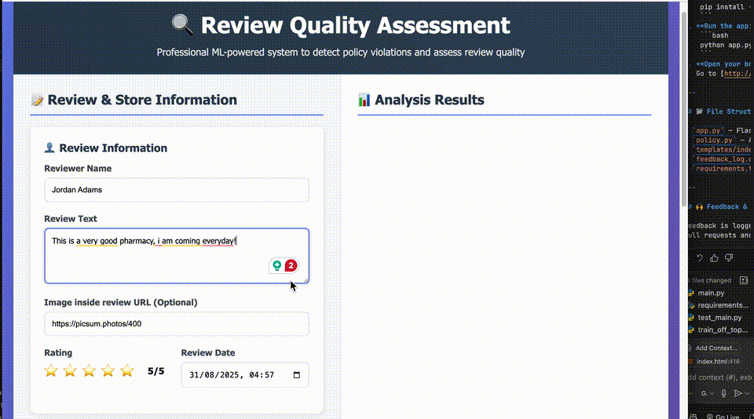

# The Fantastic For: Review Moderation Demo

This project is an **AI-powered review moderation system** inspired by real-world challenges on platforms like Google map, where review content must be quickly and fairly evaluated for policy violations.

---



## 🌟 Shining Points

- **Modern UI:**  
  A clean, interactive web interface built with HTML, CSS, and JavaScript, allowing users to submit reviews, see detailed moderation results, and provide feedback on the system’s accuracy.

- **Multi-Aspect AI Moderation:**  
  The backend uses a combination of **zero-shot classification**, **sentiment analysis**, **NSFW image detection**, and **heuristic rules** to evaluate reviews for:
  - Advertisement/promotional content
  - Relevance to the business category
  - Visit authenticity (bot/spam detection)
  - Review quality
  - Offensive/insulting language
  - Image policy violations (including NSFW and stock photo detection)

- **Zero-Shot & Sentiment Models:**  
  Utilizes Hugging Face’s `distilbert-base-uncased-mnli` for semantic relevance and insult detection, and `distilbert-base-uncased-finetuned-sst-2-english` for sentiment analysis—no custom training required.

- **Image Moderation:**  
  Detects NSFW content and promotional/stock images using lightweight vision models.

- **Feedback Loop:**  
  Users can provide feedback on moderation accuracy, which is logged for future benchmarking and model improvement.

- **Robust Error Handling:**  
  Handles missing or malformed data gracefully, both in the backend and the UI.

---

## 🚀 How It Works

1. **User submits a review** (text, star rating, optional image, and business info) via the web UI.
2. **Backend (Flask) analyzes the review** using a combination of:
    - **Zero-shot classification** to check if the review is relevant to the business category/description.
    - **Sentiment analysis** to ensure the review’s tone matches the star rating.
    - **Heuristics** to catch generic, spammy, or bot-like reviews.
    - **Image analysis** for NSFW or promotional content.
3. **Results are displayed in the UI** with detailed breakdowns and a recommended action (APPROVE, FLAG, REMOVE).
4. **User can give feedback** on the moderation result, which is stored for benchmarking.

---

## 🛠️ Techniques Used

- **Zero-shot classification** (`distilbert-base-uncased-mnli`) for semantic relevance and insult detection.
- **Sentiment analysis** (`distilbert-base-uncased-finetuned-sst-2-english`) for review tone.
- **NSFW image detection** (e.g., `Falconsai/nsfw_image_detection`).
- **Regex and keyword heuristics** for spam, promo, and bot detection.
- **Dynamic UI** with feedback buttons and real-time result display.
- **CSV logging** for user feedback and moderation benchmarking.

---

## 🎬 TikTok Context

This project demonstrates how **AI and modern web tech** can be combined to build a robust, interactive moderation tool—perfect for platforms like TikTok, where content safety and user experience are critical.  
The UI is designed for clarity and engagement, making it easy for both users and moderators to understand and trust the moderation process.

---

## 🖥️ Demo Screenshot

  
*The UI shows moderation results, detailed policy checks, and feedback buttons.*

---

## 🏁 Getting Started

1. **Install dependencies:**
    ```bash
    pip install -r requirements.txt
    ```
2. **Run the app:**
    ```bash
    python app.py
    ```
3. **Open your browser:**  
   Go to [http://localhost:5000](http://localhost:5000)

4. **It is possible to use through API:**
   The API is documented in file ./api_documentation.md
---

## 📂 File Structure

- `app.py` — Flask backend and moderation logic
- `policy.py` — AI and heuristic moderation functions
- `templates/index.html` — Web UI
- `feedback_log.csv` — Feedback log (auto-generated)
- `requirements.txt` — Python dependencies

---

## 🙌 Feedback & Contributions
Feedback is logged and used to improve the moderation system.  
Pull requests and suggestions are welcome!
